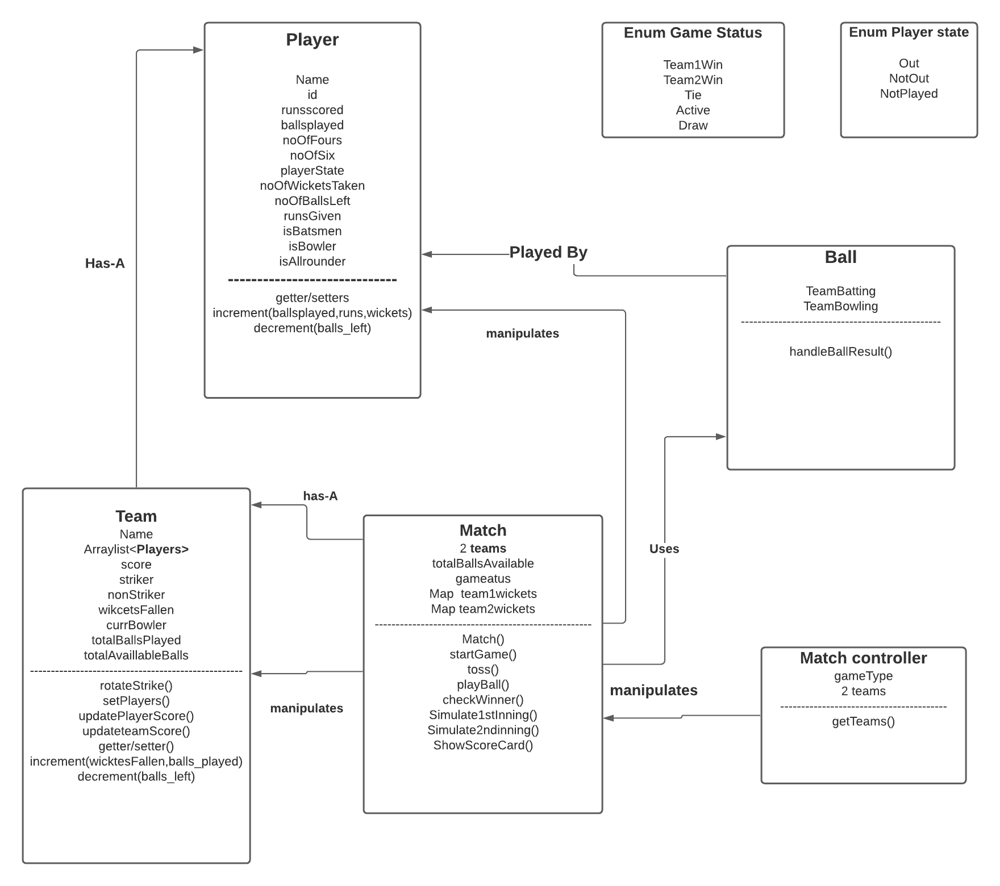
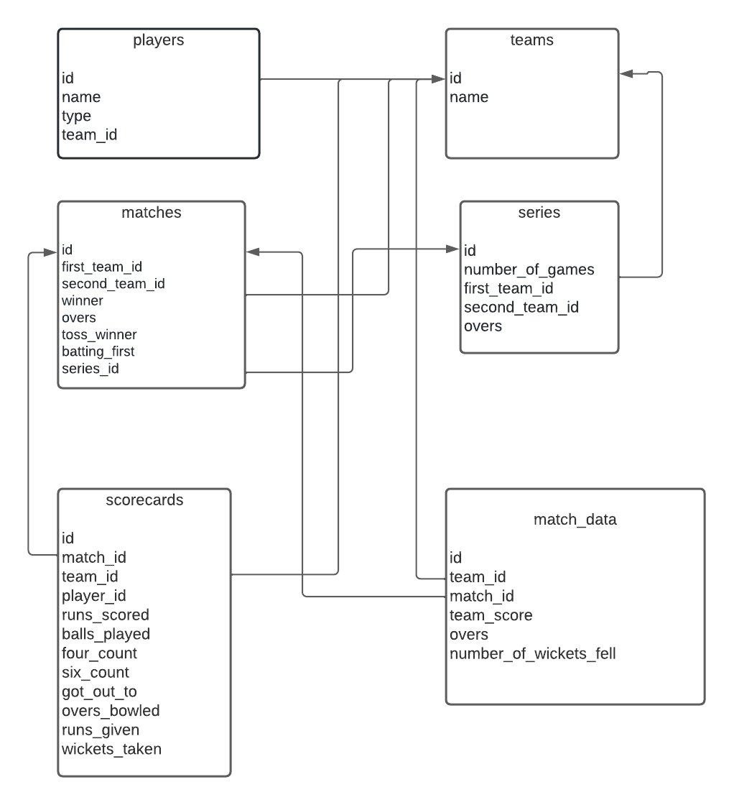

# Game Flow

* get input whether its a Single game or series.
* For Single Game:
    * Initialise a Match
    * Inside constructor take number of overs, and both team players as input.
    * Then we can call for start/simulate match method.
    * Toss [ generate a random number, if even Team1 will won  otherwise Team2 won the toss . again generate a random number to decide if the winner will bat or bowl].
    * First Inning:
        * Loop over all the overs and call PlayBall method for each ball . manage strike, score, batsmen and bowler stats according to the result of each ball.
        * stop the first inning when each overs are finished or all wickets fell.
    * Second inning:
        * Loop over all the overs and call PlayBall method for each ball . manage strike, score, batsmen and bowler stats according to the result of each ball.
        * stop the first inning when each overs are finished or all wickets fell. or the runs scores gets geater than the first team.
    * Result:
    * Compare the runs scored by both teams to decide the result.
    * Print the scorecard with all the stats.
* For Series:
    * Loop over the Process of Single Game for every game in the series.
    * keep track of the number of matches won by each team.
    * Result:
        * check which team won more number of games.

Picking A Bolwer:
* Should not have bowled the previous over.
* have number of balls left >0
* is a bowler/allrounder

PlayBall Controller:
for each ball print ‘bowler’ to ‘batsmen’ and the result of the ball.
* 1,3,5:
    * update player and team score and runs given by bowler.
    * change strike
    * update ballsplayed and balls left
* 2,4,6:
    * update player,team score and runs given by bowler
    * Don’t change strike
    * update 4,6 count
    * update balls played and balls left
* Wicket:
    * mark player out
    * increase wicket count
    * store batsmen and bowler in wickets map
    * update balls played and balls left
    * update wickets count of bowler
* After each ball update balls left for bowler.
* change strike after each over.

## Class Diagram

## Database Design Diagram

