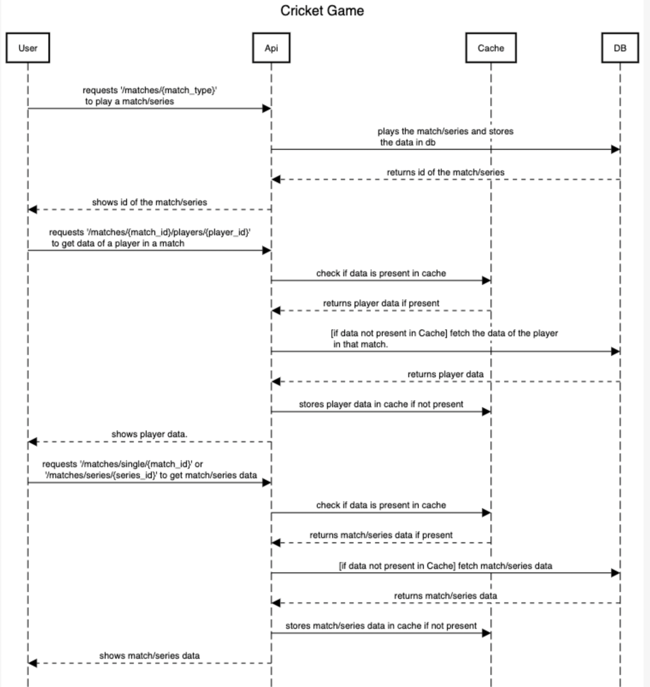
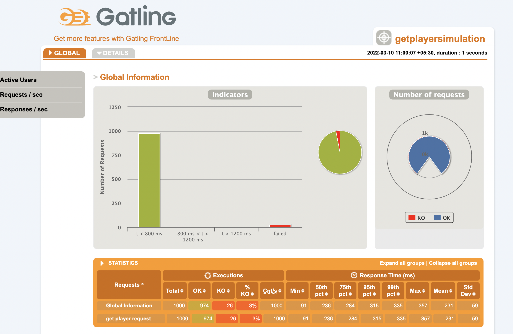

# Game Flow

* get input whether its a Single game or series.
* For Single Game:
    * Initialise a Match
    * Inside constructor take number of overs, and both team players as input.
    * Then we can call for start/simulate match method.
    * Toss [ generate a random number, if even Team1 will won  otherwise Team2 won the toss . again generate a random number to decide if the winner will bat or bowl].
    * First Inning:
        * Loop over all the overs and call PlayBall method for each ball . manage strike, score, batsmen and bowler stats according to the result of each ball.
        * stop the first inning when each overs are finished or all wickets fell.
    * Second inning:
        * Loop over all the overs and call PlayBall method for each ball . manage strike, score, batsmen and bowler stats according to the result of each ball.
        * stop the first inning when each overs are finished or all wickets fell. or the runs scores gets geater than the first team.
    * Result:
    * Compare the runs scored by both teams to decide the result.
    * Print the scorecard with all the stats.
* For Series:
    * Loop over the Process of Single Game for every game in the series.
    * keep track of the number of matches won by each team.
    * Result:
        * check which team won more number of games.

Picking A Bolwer:
* Should not have bowled the previous over.
* have number of balls left >0
* is a bowler/allrounder

PlayBall Controller:
for each ball print ‘bowler’ to ‘batsmen’ and the result of the ball.
* 1,3,5:
    * update player and team score and runs given by bowler.
    * change strike
    * update ballsplayed and balls left
* 2,4,6:
    * update player,team score and runs given by bowler
    * Don’t change strike
    * update 4,6 count
    * update balls played and balls left
* Wicket:
    * mark player out
    * increase wicket count
    * store batsmen and bowler in wickets map
    * update balls played and balls left
    * update wickets count of bowler
* After each ball update balls left for bowler.
* change strike after each over.

## Class Diagram

## Database Design Diagram

### Storing Match into DB:
* While Initialising the team we are storing [team_name,team_id] into teams table.
* For each team we are storing players info [id,name,type,team_id] into the players table.
* After every match we are storing match info [id,first_team_id,second_team_id,winner,overs,
  toss_winner,batting_first,series_id] into the matches table.
* For every match series_id will be -1 if the match is a standalone match i.e. it's not part of a series.
* For series, we are storing [is,number_of_games,first_team_id,second_team_id,overs] into the series table.
* After every match we are storing each team's data for the particular match [id,team_id,match_id,team_score,overs,number_of_wickets_fell] into match_data table.
* For storing Scorecard, we are storing each players' stats [match_id,team_id,player_id,runs_scored,balls_played,four_count,six_count,got_out_to,overs_bowled,runs_given,wickets_taken] into the scorecard table after each match.

### Fetching Match data from DB:
* We have to enter match_id for fetching match data.
* using that match_id we are fetching that match's info from matches table.
* by now we have match_id and both teams' ids. using that we can get teams' info from teams table.
* for getting each teams stats for that particular match we can use team_id and match_id to fetch data from match_data table.
* for fetching scorecard, we can use match_id and team_id to fetch data from scorecards table.

### Sequence Diagram:

### swagger api:

### Load Testing Simulations Result
* below are the results of a load testing simulations on the
  given apis.
* Load testing is still in progress. will keep on updating results.

#### for url ('/matches/{match_type}')

#### for url ('/matches/single/{match_id}')

#### for url ('/matches/{match_id}/players/{player_id}'')

